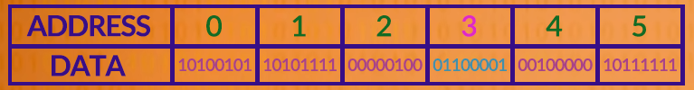

# Les chars

## Brève description
Les `char` en C sont un type de donnée contenant une <ins>valeur entière</ins> (1, 45, 30 etc..), représenté par 1 byte stocké en mémoire. C'est le type utilisant la plus petite quantité de mémoire.
<br>
C'est lors de l'utilisation d'une fonction de `print` que s'affichera visuellement le caractère correspondant (nous verrons cela par la suite). Mais sinon, garder en tête qu'un char contient un `entier`.

## Première approche

```c
char lettre = 97;
```

Dans ce code, à l'adresse mémoire de notre variable `lettre` (disons l'adresse `0x3`), sera stocké notre entier `97` représenté par 1 byte (soit une série de 8 bits représentant notre valeur), soit : `0110 0001`.
<br>
Voici un schéma de la parti de la mémoire contenant notre `char`:



Etant limité à 1 Byte (soit 8 bits), nous sommes donc intrinséquement limité à 256 valeurs différentes représentable. De l'entier `0` représenté en binaire par `0000 0000` - à l'entier `255` représenté en binaire par `1111 1111`.

> Il existe une notion de type signé et non-signé qui changeront cet interval de valeurs, mais nous verront cela dans la suite de ce chapitre.

## Différentes notations

Au lieu d'écrire directement l'entier `97`, on pourrait écrire le caractère ASCII correspondant à cette valeur :

```c
char letter = 'a';
```

Ici, votre compilateur C remplaçera `'a'` par la valeur décimal correspondante dans la table [ASCII](chars/ascii.md), soit `97`. Prenez le schéma de la mémoire plus haut, la valeur contenu à l'adresse de `letter` sera <ins>identique</ins>.
<br>
`'a'` dans notre code est un [character literal](chars/character-literals.md) et nous verront cela plus en détail dans la suite de ce chapitre

Nous aurions pu aussi indiqué une valeur binaire, hexadecimal, octal etc:

```c
char letter_bin = 0b01100001; # binary
char letter_hex = 0x61; # hexadecimal
char letter_oct = 0141; # octal
```

Ici toutes ces valeurs en hexadécimal/binaire/octal représentent ultimement l'entier `97`, c'est au moment de compiler que le compilateur remplaçera ces valeurs. Elles seront donc stockés en mémoire sur 8 bits par la même valeur: `0110 0001`

## Print un char sur le terminal

Pour afficher la caractère [ASCII](chars/ascii.md) correspondant à la valeur stocké dans notre <i>char</i>, différentes fonctions peuvent être utiliser, notamment `printf()` et `putchar()`.

```c
#include <stdio.h> # printf

char letter = 97;
printf("%c\n", c);
```

Output:
```python
$> ./a.out
$> a
$> 
```

Notre variable `letter` contient l'entier `97`. Dans la table [ASCII](chars/ascii.md) l'entier `97` correspond au caractère `a`. C'est la fonction `printf()` qui à partir de cet entier, affichera visuellement notre caractère `'a'`. Nous aurions aussi pu utiliser des fonctions similaires tel que `putchar()`.<br><br>
Si vous avez bien compris que c'est donc l'entier `97` qui est passé à printf, vous comprendrez que l'on aurait très bien pu stocker cette valeur dans un `int`, voire un `long`, et tenter de l'afficher avec `printf()`, et le résultat aurait été le même.

<hr>