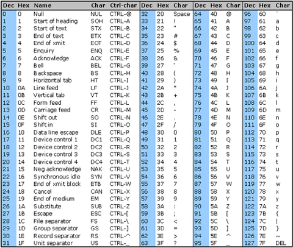

Il n'est pas nécessaire d'avoir lu les précédents sous-chapitres pour lire celui-ci.

# Standard ASCII Table

La table ASCII standarde est un tableau de valeurs, mettant en relation des valeures décimal allant de 0 à 127 (et ses homologues en base 2/8/16), avec des caractères.

On peut y retrouver l'alphabet en minuscule/majuscule, tous les chiffres, quelques caractères de ponctuations, des caractères de contrôles (intéprétés par certains programmes comme des instructions).

# Extended ASCII Table

La table ASCII étendu reprend les 128 caractères de la table ASCII standarde, et y rajoute à leur suite 128 autres caractères :

L'utilisation de la table ASCII a diminué aujourd'hui au profit de la table Unicode. Cette dernière permet de représenter un nombre considérablement plus élevé de caractères(149 186 dans sa version 15.0) permettant de couvrir les alphabets de différentes langues, des emojis, davantages de signes etc.

Tous les caractères de la table ASCII sont présent dans la table Unicode. La table ASCII reste cependant toujours utilisé dans un soucis de rétro-compatibilité, mais aussi parce qu'étant codé sur 7 bits(8 pour la table étendu) il est plus simple de les manipuler et consomment moins de mémoire comparé aux 7 à 32 bits de la table Unicode.